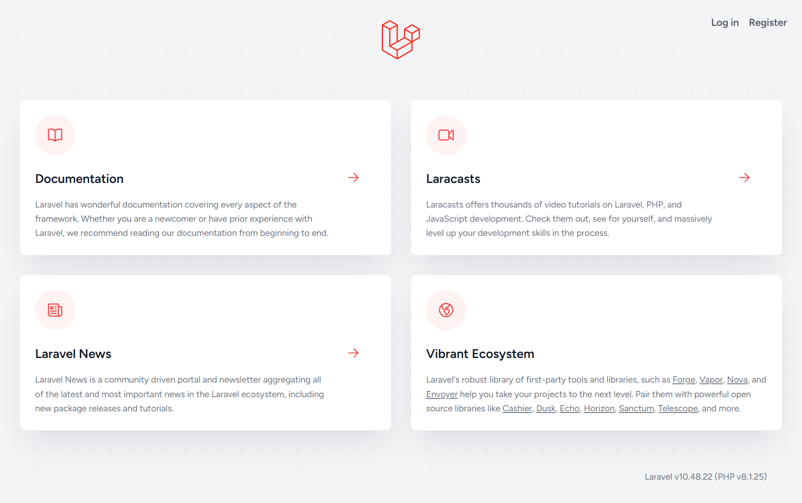

# React Form Builder

Welcome to the **React Form Builder** project! This dynamic form builder application is built with React on the frontend and Laravel on the backend. It enables users to create, customize, save, edit, and delete forms with various field types. The app features drag-and-drop functionality and integrates seamlessly with a Laravel API for form storage and management.

---

## 📋 Table of Contents
- [Features](#features)
- [Technologies](#technologies)
- [Prerequisites](#prerequisites)
- [Usage](#usage)
- [API Endpoints](#api-endpoints)
- [Screenshots](#screenshots)
- [Contributing](#contributing)
- [License](#license)

---

## 🚀 Features
- **Drag-and-Drop**: Easily reorder form elements with the intuitive drag-and-drop functionality powered by [react-beautiful-dnd](https://github.com/atlassian/react-beautiful-dnd).
- **Form Elements**: Add and customize various field types like:
  - Text inputs
  - Textareas
  - Checkboxes
  - Radio buttons
  - Date pickers
  - File uploads
- **Customization**: Edit the properties of each form element including:
  - Label
  - Placeholder
  - Name
  - Type
- **Save and Load Forms**: Save your forms to the API, load existing forms for editing, or delete forms you no longer need.
- **Search**: Find saved forms easily by their name.
- **Real-Time Feedback**: Get instant feedback on actions such as saving, updating, or deleting forms.

---

## 💻 Technologies
- **Frontend**:
  - React
  - [Axios](https://axios-http.com/) for API requests
  - [react-beautiful-dnd](https://github.com/atlassian/react-beautiful-dnd) for drag-and-drop functionality
  - Vite for fast build times
- **Backend**:
  - Laravel
  - MySQL database

---

## 📦 Prerequisites
Before you begin, ensure you have the following installed:

- npm (for frontend dependencies)
- PHP (>=7.4)
- Composer (for PHP dependency management)
- MySQL (for the database)

---

## 🖥️ Usage

1. Open the application in your browser at `http://127.0.0.1:8000/`.
2. Use the sidebar buttons to add form fields.
3. Edit properties for each field in the "Edit Properties" section.
4. Drag and drop fields to reorder them.
5. Click "Save Form" to store the form via the API.
6. Search for saved forms by name.
7. Edit or delete saved forms as needed.

---

## 🌐 API Endpoints

The backend exposes the following API endpoints:

- **GET** `/api/lists`: Fetch all saved forms
- **POST** `/api/forms/save`: Save a new form
- **GET** `/api/forms/{id}`: Retrieve a specific form
- **PUT** `/api/forms/update/{id}`: Update an existing form
- **DELETE** `/api/forms/{id}`: Delete a form

Make sure your backend is properly handling these requests and responds with appropriate status messages.

---

## 🖼️ Screenshots

Here are some visuals of the application:

- 
---
- 
---
- 
---
- 
---
- 
---
- 

---

## 🤝 Contributing

We welcome contributions! If you’d like to improve this project, please feel free to submit a Pull Request.

---

## 📜 License

This project is licensed under the [MIT License](LICENSE).

---
